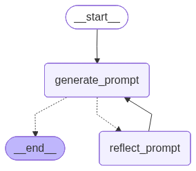

# Reflection Agent for Prompt Engineering

A LangGraph-based reflection agent that iteratively generates and refines high-quality prompts through self-critique and improvement cycles.

## Overview

This project implements a **reflection agent** - an AI agent that improves its outputs by critiquing and refining them through multiple iterations. The agent consists of two specialized nodes working in tandem:

- **Generation Node**: Creates prompts based on user requirements and previous feedback
- **Reflection Node**: Analyzes generated prompts and provides constructive critique with specific improvement suggestions

This approach trades computational cost for output quality, making it ideal for tasks where precision and quality matter more than speed.

## Inspiration

This implementation is inspired by the reflection agent pattern described in the [LangChain blog post on Reflection Agents](https://blog.langchain.com/reflection-agents/).

### What is Reflection?

Reflection is a prompting strategy that improves AI system quality by having models examine their past outputs and provide constructive feedback. This mirrors what cognitive scientists call **System 2 thinking** - deliberate, methodical reasoning rather than reactive responses.

The reflection process works through alternating generation and critique loops:

1. **Generate**: The agent creates an initial output based on the user's request
2. **Reflect**: A second pass analyzes the output, identifying weaknesses and areas for improvement
3. **Revise**: Using the critique, the agent generates an improved version
4. **Repeat**: This cycle continues for a specified number of iterations

By iteratively refining outputs and exploring multiple solution paths, reflection agents demonstrate significantly improved performance on complex reasoning and generation tasks.

## Features

- **Iterative Refinement**: Automatically improves prompts through multiple reflection cycles
- **Structured Output**: Uses Pydantic schemas for consistent, type-safe model outputs
- **Token Tracking**: Comprehensive token usage monitoring for both generation and reflection nodes
- **LangSmith Integration**: Full observability and debugging with LangSmith tracing support
- **Conversation History**: Maintains full context across iterations for coherent improvements
- **Configurable**: Adjustable model selection, temperature, and iteration limits
- **Production-Ready**: Clean architecture with proper error handling and Google-style documentation

## Prerequisites

- Python 3.10 or higher
- Google API Key (for Gemini models)
- Basic understanding of LangChain and LangGraph (helpful but not required)

## Installation

1. **Clone the repository**
```bash
git clone <repository-url>
cd ReflectionAgent
```

2. **Create a virtual environment**
```bash
python -m venv .venv
source .venv/bin/activate  # On Windows: .venv\Scripts\activate
```

3. **Install dependencies**
```bash
pip install -r requirements.txt
```

4. **Set up environment variables**

Create a `.env` file in the project root:
```bash
GOOGLE_API_KEY=your_google_api_key_here

# Optional: Enable LangSmith tracing for debugging and monitoring
LANGCHAIN_TRACING_V2=true
LANGCHAIN_API_KEY=your_langsmith_api_key_here
LANGCHAIN_PROJECT=reflection-agent
```

Get your Google API key from [Google AI Studio](https://makersuite.google.com/app/apikey).

**Optional: Enable LangSmith Tracing** for detailed observability, debugging, and performance monitoring. Sign up at [LangSmith](https://smith.langchain.com/) to get your API key.

## Project Structure

```
ReflectionAgent/
├── core/
│   ├── __init__.py
│   └── reflection_agent.py      # Main agent implementation with LangGraph workflow
├── schemas/
│   ├── __init__.py
│   └── output_parsers.py         # Pydantic schemas for structured outputs
├── prompts/
│   ├── __init__.py
│   ├── system_messages.py        # System prompts for generation and reflection nodes
│   ├── prompt_templates.py       # LangChain PromptTemplate definitions
│   └── prompt_formatter.py       # Formatting utilities for outputs
├── utils/
│   └── token_utils.py            # Token tracking and aggregation utilities
├── tests/
│   ├── example_run.py            # Example test run script
├── visualizations/
│   ├── visualize.py              # Script to generate workflow graph visualization
│   └── reflection_agent_graph.png # Generated workflow diagram
├── .env                          # Environment variables (create this)
├── .gitignore                    # Git ignore file
├── .python-version               # Python version specification
├── pyproject.toml                # Project metadata and dependencies
├── uv.lock                       # UV lock file for reproducible builds
├── requirements.txt              # Project dependencies (pip compatible)
└── README.md                     # Project Readme
```

## Architecture

The agent uses a two-node LangGraph workflow with conditional edges:



**Workflow:**
1. **Start** → Initial user input
2. **generate_prompt** → Creates or refines the prompt based on feedback
3. **Decision Point** → Check if max iterations reached
   - If **No** → Continue to reflect_prompt
   - If **Yes** → End
4. **reflect_prompt** → Analyzes the prompt and provides critique
5. **Loop Back** → Reflection feedback feeds into next generation iteration

## Usage

### Basic Example

```python
from core.reflection_agent import ReflectionAgent

# Initialize the agent
agent = ReflectionAgent(
    model_name="gemini-2.0-flash-exp",
    temperature=0.7,
    max_iterations=2
)

# Run the agent
result = agent.run(
    "Create a prompt for writing a Python function that validates email addresses"
)

# Access results
print(f"Completed {result['iterations']} iterations")
print(f"\nFinal prompt:\n{result['generations'][-1]['generated_prompt']}")
print(f"\nToken usage: {result['total_tokens']}")
```

### Running the Example

```bash
python example.py
```

### Visualizing the Workflow

```python
agent.visualize_graph("workflow.png")
```

## How It Works

### 1. Generation Node

The generation node receives:
- System message with prompt engineering guidelines
- User's initial request
- Previous reflection feedback (if any)

It produces:
- A generated prompt
- Reasoning explaining the design decisions

### 2. Reflection Node

The reflection node analyzes the generated prompt and provides:
- Critical analysis identifying weaknesses
- Specific, actionable improvement suggestions

The feedback is formatted as a HumanMessage and fed back into the generation node.

### 3. Iteration Loop

The agent continues the generate → reflect → revise cycle until:
- Maximum iterations are reached

### 4. Results

After completion, you receive:
- All generated prompts with reasoning
- All reflection critiques and suggestions
- Comprehensive token usage statistics (overall, per-node)
- Full conversation history

## LangSmith Tracing

This project supports [LangSmith](https://smith.langchain.com/) - LangChain's observability and debugging platform. LangSmith provides detailed tracing of your agent's execution, making it easy to debug, monitor performance, and understand the decision-making process.

### Why Use LangSmith?

- **Full Execution Traces**: See every step of the generation and reflection loop
- **Token Usage Analytics**: Track token consumption per node and iteration
- **Performance Monitoring**: Identify bottlenecks and optimize latency
- **Debugging**: Inspect inputs/outputs at each node to diagnose issues
- **Cost Tracking**: Monitor API costs across all runs
- **Conversation History**: Visualize the full message flow through the graph

### Enabling LangSmith

1. **Sign up** at [smith.langchain.com](https://smith.langchain.com/)
2. **Get your API key** from the settings page
3. **Add to `.env` file**:
   ```bash
   LANGCHAIN_TRACING_V2=true
   LANGCHAIN_API_KEY=your_langsmith_api_key_here
   LANGCHAIN_PROJECT=reflection-agent
   ```
4. **Run your agent** - traces will automatically appear in the LangSmith dashboard

### What You'll See

When you run the agent with LangSmith enabled, each execution creates a trace showing:

- **Graph Execution**: Visual representation of the workflow with timing
- **Node Details**: Input/output for each generation and reflection node
- **Token Metrics**: Detailed token usage per LLM call
- **Metadata**: Model used, temperature, and other configuration
- **Error Traces**: Stack traces if anything goes wrong

### Example Trace Structure

```
Run: reflection-agent
├─ generate_prompt (Node 1)
│  ├─ Input: User request
│  ├─ LLM Call: gemini-2.0-flash-exp
│  │  └─ Tokens: 450 in, 320 out
│  └─ Output: Generated prompt + reasoning
├─ reflect_prompt (Node 1)
│  ├─ Input: Generated prompt
│  ├─ LLM Call: gemini-2.0-flash-exp
│  │  └─ Tokens: 680 in, 180 out
│  └─ Output: Critique + suggestions
├─ generate_prompt (Node 2)
│  └─ ...
└─ Total Duration: 8.3s
```

LangSmith is particularly valuable for this reflection agent because it lets you see how the prompt evolves across iterations and understand what feedback drives improvements.

## Configuration Options

```python
ReflectionAgent(
    model_name="gemini-2.0-flash-exp",  # Gemini model to use
    temperature=0.7,                     # 0.0 = deterministic, 1.0 = creative
    max_iterations=3                     # Number of reflection cycles
)
```

### Available Models

See the [Gemini API Models documentation](https://ai.google.dev/gemini-api/docs/models) for the full list of available models and their capabilities.

## Output Structure

```python
{
    "messages": [...],              # Full conversation history (BaseMessage objects)
    "iterations": 2,                # Completed iterations
    "generation_tokens": {          # Generation node token usage
        "input_tokens": 450,
        "output_tokens": 320,
        "total_tokens": 770,
        "successful_requests": 3
    },
    "reflection_tokens": {          # Reflection node token usage
        "input_tokens": 680,
        "output_tokens": 180,
        "total_tokens": 860,
        "successful_requests": 2
    },
    "total_tokens": {               # Overall token usage
        "input_tokens": 1130,
        "output_tokens": 500,
        "total_tokens": 1630,
        "successful_requests": 5
    },
    "generations": [                # All generation outputs
        {
            "generated_prompt": "...",
            "reasoning": "..."
        }
    ],
    "reflections": [                # All reflection outputs
        {
            "critique": "...",
            "suggestions": [...]
        }
    ]
}
```

## Use Cases

This reflection agent excels at:

- **Prompt Engineering**: Creating high-quality prompts for specific tasks
- **Content Refinement**: Iteratively improving any text-based output
- **Requirements Analysis**: Refining specifications through critical analysis
- **Documentation**: Generating clear, comprehensive documentation
- **Technical Writing**: Creating well-structured technical content

## Performance Considerations

- **Cost vs Quality**: More iterations = higher quality but increased API costs
- **Token Usage**: Monitored per-node for cost optimization and debugging
- **Max Iterations**: The agent runs for the specified number of iterations before stopping
- **Latency**: Expect ~2-5 seconds per iteration depending on model and complexity
- **Optimal Iterations**: 2-3 iterations typically provide best quality/cost balance

## Key Components

### Pydantic Schemas

**GenerationOutput** (`schemas/output_parsers.py`):
- `generated_prompt`: The generated prompt text
- `reasoning`: Explanation of design decisions

**ReflectionOutput** (`schemas/output_parsers.py`):
- `critique`: Critical analysis
- `suggestions`: List of improvement suggestions

### Agent State

The `AgentState` TypedDict tracks:
- `messages`: Conversation history with automatic message merging
- `iterations`: Current iteration count
- `max_iterations`: Stopping condition
- `token_usage`: Overall token usage
- `generation_tokens`: Generation node tokens
- `reflection_tokens`: Reflection node tokens
- `generations`: All generation outputs
- `reflections`: All reflection outputs

### System Messages

Located in `prompts/system_messages.py`:
- **GENERATION_SYSTEM_MESSAGE**: Guides the generation node to create effective prompts
- **REFLECTION_SYSTEM_MESSAGE**: Instructs the reflection node to provide constructive critique

## Demo Run: Wi-Fi Troubleshooting Chatbot

This section demonstrates the ReflectionAgent in action, showing how it iteratively refines a prompt through multiple generation-reflection cycles.

### Test Prompt

```python
user_input = """
Create a prompt for a chatbot that helps users troubleshoot Wi-Fi connection issues
"""
```

**Configuration**:
- Model: `gemini-3-flash-preview`
- Temperature: `0.2`
- Max Iterations: `3`

### Performance Overview

The agent completed **4 generation cycles** with **3 reflection rounds**, producing progressively more sophisticated prompts. Each reflection identified specific weaknesses and provided actionable suggestions, which were incorporated into the next generation.

**Key Improvements Across Iterations**:
1. **Generation 1**: Basic structured framework with diagnostic phases
2. **Generation 2**: Added ISP outage checks, scope detection, and fallback strategies
3. **Generation 3**: Introduced diagnostic branching, visual verification, and change detection
4. **Generation 4**: Incorporated safety warnings, resolution verification, and simplified technical language

### Generation Outputs

#### Generation 1: Initial Framework


**Strengths**:
- Established clear persona (Technical Support Specialist)
- Created logical troubleshooting phases (Physical → Settings → Power Cycle → Environment → Advanced)
- Included "one step at a time" guidance
- Defined professional tone and formatting rules

**Weaknesses Identified by Reflection 1**:
- No mechanism to check what user already tried (risk of redundant steps)
- Missing early ISP outage verification
- No fallback strategy when users can't find settings
- Doesn't distinguish between single-device vs. all-device issues
- Lacks Mesh Wi-Fi specific handling

---

#### Generation 2: Scope & Efficiency Improvements


**New Features Added**:
- **Pre-diagnostic phase**: Asks what user already attempted
- **Scope detection**: One device vs. all devices in building
- **ISP outage check**: Verifies external issues before local troubleshooting
- **Fallback strategy**: Provides UI synonyms if user can't find settings
- **Mesh Wi-Fi support**: Instructions for checking satellite nodes
- **Troubleshooting Summary**: Documentation for escalation to ISP

**Weaknesses Identified by Reflection 2**:
- Becoming a "wall of text" without clear structure
- No differentiation between "Total Outage" vs. "Intermittent Connection" issues
- Missing "Recent Changes" question (environmental factors)
- Lacks visual hardware verification (router light status)
- No post-resolution preventative tips

---

#### Generation 3: Diagnostic Branching & Structure


**Major Structural Changes**:
- **Markdown headers**: Clear phase separation to prevent LLM confusion
- **Change detection**: "Have you moved the router or added devices?" question
- **Visual verification**: Check router LED status early
- **Diagnostic branching**:
  - **Path A** (Total Outage): Focus on physical layer, authentication
  - **Path B** (Slow/Intermittent): Focus on congestion, interference, Mesh placement
- **Network congestion handling**: Channel switching for crowded areas
- **Post-resolution tips**: Preventative maintenance advice

**Weaknesses Identified by Reflection 3**:
- Missing safety warnings for handling electrical equipment
- Assumes users know how to access router admin panel
- No success verification before closing support session
- Lacks device-specific UI instructions (phone vs. computer)
- Power cycle timing not specific enough (capacitor discharge)
- Technical jargon used without analogies

---

#### Generation 4: Safety, Verification & Accessibility


**Final Refinements**:
- **Safety-first approach**: Warnings about wet hands and forcing cables
- **Device type question**: Asks if troubleshooting from computer or mobile
- **Safety warning**: Dry hands, avoid wet surfaces
- **Router access module**: How to find admin IP and credentials on sticker
- **Specific power cycle timing**: 60-second wait for capacitor discharge
- **Resolution verification**: Speed test or HD video load to confirm fix holds
- **Language simplification**: "SSID (your Wi-Fi network name)", "5GHz (faster, short-range lane)"
- **Enhanced fallback strategy**: Platform-specific menu path synonyms

---

### Reflection Analysis


The reflection node consistently provided:
- **Critical analysis** identifying gaps in coverage and user experience
- **Specific, actionable suggestions** (6 suggestions per reflection on average)
- **Progressive depth**: Each reflection targeted more nuanced issues (from basic flow to safety and accessibility)

**Reflection Evolution**:
1. **Reflection 1**: Focused on workflow efficiency (redundancy prevention, scope detection)
2. **Reflection 2**: Addressed structure and diagnostic logic (branching, visual checks)
3. **Reflection 3**: Emphasized safety, verification, and accessibility (non-technical users)

---

### Token Usage


| Metric | Generation Tokens | Reflection Tokens | Total Tokens |
|--------|------------------|-------------------|--------------|
| **Input Tokens** | 6,307 | 5,073 | 11,380 |
| **Output Tokens** | 4,660 | 1,984 | 6,644 |
| **Total Tokens** | 10,967 | 7,057 | 18,024 |
| **Requests** | 4 | 3 | 7 |

**Cost Analysis** (approximate, based on Gemini 2.5 Flash pricing):
- Total tokens: ~18K tokens
- Cost-efficient for the quality improvement achieved
- Each iteration added significant value through targeted refinements

---

### LangSmith Tracing


The LangSmith trace provides full observability into the agent's execution:
- **Complete conversation history** across all iterations
- **Per-node token metrics** for generation and reflection
- **Execution timing** for each LLM call
- **Structured output validation** at each step

This enables debugging, performance optimization, and understanding the agent's decision-making process.

---

### Key Takeaways

1. **Quality vs. Cost Trade-off**: 4 iterations produced a production-ready prompt that covered edge cases, safety, and accessibility—well worth the 18K token investment

2. **Iterative Refinement Works**: Each generation incorporated feedback effectively, showing the reflection pattern's value for complex prompt engineering

3. **Reflection Quality**: The critique was specific and actionable, identifying gaps a human prompt engineer would catch (safety warnings, admin panel access, resolution verification)

4. **Diminishing Returns**: Major improvements happened in iterations 2-3, suggesting 3-4 iterations is optimal for most use cases

5. **Real-World Applicability**: The final prompt is comprehensive enough for actual deployment in a customer support context

## Future Implementations/Improvements

### 1. Structured Output with Different Model Sizes

The agent currently uses LangChain's [`with_structured_output`](https://docs.langchain.com/oss/python/langchain/models#structured-output) method to enforce Pydantic schema validation on model outputs. This approach works best with larger, more capable LLMs such as:
- Gemini 2.5 Flash
- Gemini 3 Flash
- Other frontier models with strong instruction-following capabilities

**Limitation**: Smaller or less capable LLMs may throw errors during output parsing as they struggle to consistently produce valid structured outputs.

**Potential Solution**: For broader model compatibility, implement traditional LangChain chains with output parsers instead of relying on `with_structured_output`. This provides more robust error handling and retry logic for models that don't natively support structured output well.

### 2. LLM-Agnostic Implementation

Currently, the agent is tightly coupled to Google's Gemini models. A planned improvement is to make the agent model-agnostic using LangChain's [`init_chat_model`](https://docs.langchain.com/oss/python/langgraph/streaming#init_chat_model) utility.

This would enable:
- Support for OpenAI, Anthropic, Cohere, and other providers
- Easy model switching without code changes
- Provider-agnostic configuration
- Testing across different model families

### 3. Local LLM Support

Add functionality to run the reflection agent with locally-hosted open-source models such as:
- Llama models via Ollama
- Mistral models
- Other quantized models running on consumer hardware

This would provide:
- Privacy and data sovereignty (no API calls to external services)
- Cost savings (no per-token charges)
- Offline capability
- Customization through fine-tuned local models

### 4. Early Termination Based on Empty Suggestions

Currently, the agent runs for the full number of specified `max_iterations` regardless of output quality. A planned optimization is to add intelligent early termination when the reflection node returns an empty suggestions list.

**How it would work**:
- After each reflection, check if the suggestions list is empty
- Empty suggestions indicate the revisor believes the prompt has reached optimal quality
- Automatically terminate the loop to prevent unnecessary iterations

**Benefits**:
- **Token savings**: Avoid running additional iterations when quality has plateaued
- **Cost optimization**: Reduce API costs by stopping when further refinement isn't needed
- **Efficiency**: Faster completion times for prompts that reach optimal quality early
- **Flexibility**: Agent can still run for full iterations if continuous improvements are being made


## Acknowledgments

- Inspired by [LangChain's Reflection Agents](https://blog.langchain.com/reflection-agents/)
- Built with [LangGraph](https://github.com/langchain-ai/langgraph)
- Powered by [Google Gemini](https://ai.google.dev/)
- Observability by [LangSmith](https://smith.langchain.com/)

---

**Happy Prompting! 🚀**
